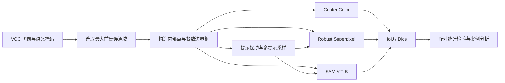
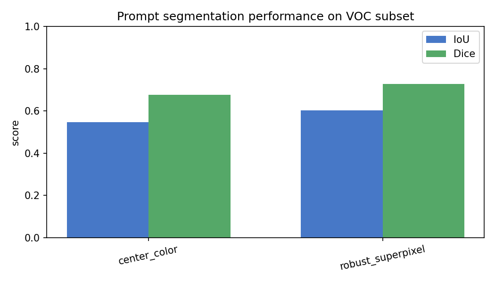
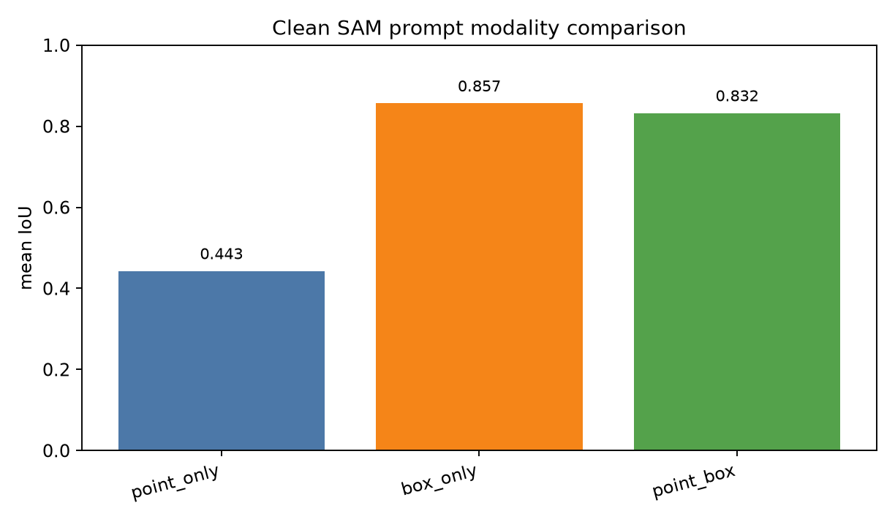
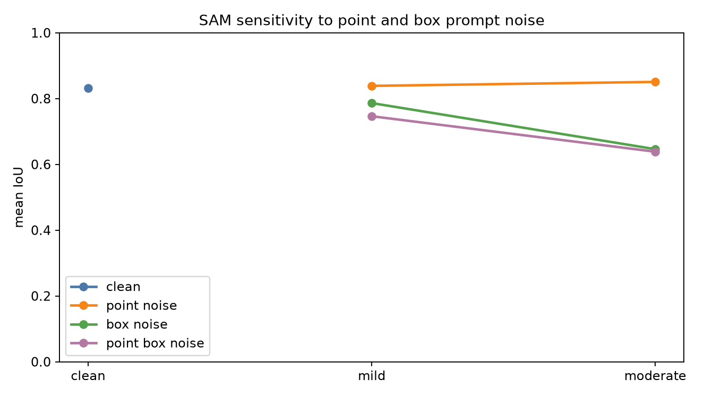
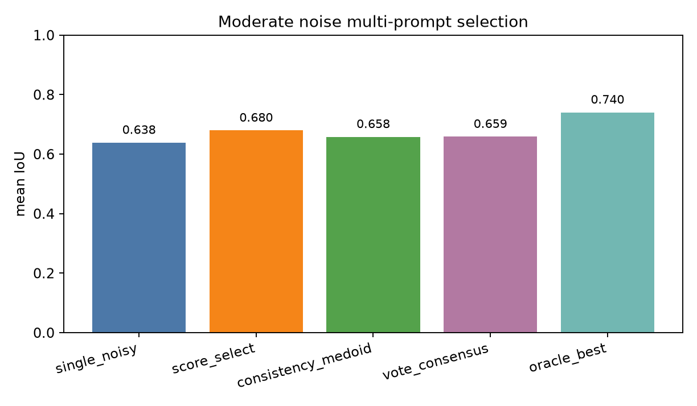

# PromptLite-Seg

> 面向 PASCAL VOC 2012 的轻量级零样本提示分割与提示不确定性研究
> Lightweight Zero-Shot Prompted Segmentation on PASCAL VOC 2012

[](https://www.python.org/)
[](https://github.com/facebookresearch/segment-anything)
[](http://host.robots.ox.ac.uk/pascal/VOC/voc2012/)
[](https://github.com/facebookresearch/segment-anything)
[](#复现实验)
[](LICENSE)

## 项目概览

PromptLite-Seg 是南京大学智能科学与技术2025人工智能导论课程设计的**方向 7：零样本提示分割**项目（课程网站https://www.lamda.nju.edu.cn/guolz/IntroAI/sp2026/exam.html）。
项目研究如何仅利用一个前景点和一个目标框，在不针对目标数据集微调模型的情况下获得物体掩码，
并进一步分析提示形式、提示噪声和多提示选择对分割性能的影响。

仓库包含两条互补的实验路径：一条是可在 CPU 上运行的透明轻量基线，另一条是使用 SAM ViT-B 的 GPU 研究实验。
除平均 IoU/Dice 外，项目还提供逐样本结果、类别分析、成功/失败案例、提示扰动实验、
配对 Bootstrap 置信区间与符号翻转置换检验。

## 创新点

相对于只报告理想提示下单一分割分数的常规课程实现，本项目主要包含以下创新与特色：

1. **面向低算力场景的多尺度共识分割。** 项目设计了无需训练的 `robust_superpixel` 方法，
   将 SLIC 超像素、Lab 颜色与空间特征、提示诱导的前景/背景原型及边界框约束统一起来，
   并在收缩、原始和扩张框上进行多尺度预测与多数共识，在 CPU 可复现的前提下提升对单一框位置的容错能力。
2. **把提示误差拆解为可分析的不确定性来源。** 实验不只比较点提示和框提示，
   还分别扰动点、框以及点 + 框，构建提示模态、噪声来源和噪声强度三个维度的评测，
   从而发现当前设置下 SAM ViT-B 的性能主要受框质量支配，而不是笼统地把所有提示误差视为等价。
3. **用多候选选择和配对统计检验连接性能与可靠性。** 项目比较模型分数选择、一致性 medoid、
   投票共识和 oracle best-of-six，并结合样本级 Bootstrap 置信区间与 sign-flip permutation test，
   区分“均值看似提升”和“证据足以支持提升”，同时量化仍可被提示质量估计器恢复的性能空间。

以上内容是本项目在方法组合、实验设计和证据链上的主要贡献，不宣称各组成技术本身属于文献中的首次提出。

## 目录

- [项目概览](#项目概览)
- [创新点](#创新点)
- [研究问题](#研究问题)
- [方法概览](#方法概览)
- [核心结果](#核心结果)
- [复现实验](#复现实验)
- [数据与提示构造](#数据与提示构造)
- [输出文件](#输出文件)
- [项目结构](#项目结构)
- [局限性](#局限性)
- [技术报告与引用](#技术报告与引用)

## 研究问题

本项目围绕四个问题展开：

1. 只依赖点和框提示的轻量、免训练方法，在真实图像上可以达到怎样的分割效果？
2. 超像素、前景/背景原型和多框共识能否稳定改进简单颜色阈值基线？
3. SAM 对点提示与框提示的依赖是否相同？哪一类提示噪声影响更大？
4. 对同一含噪提示生成多个候选，能否通过模型分数或候选一致性找回性能？

这里的“零样本”指模型或算法**不在本项目的 PASCAL VOC 子集上训练或微调**。SAM 本身仍是预训练基础模型；`center_color` 和 `robust_superpixel` 则完全不需要学习参数。

## 方法概览



### 1. Center Color 基线

在提示点附近提取 RGB 中值作为前景原型，在边界框内使用自适应 Otsu 阈值筛选颜色相近的像素，再通过形态学处理和连通域选择得到最终掩码。该方法计算量小，但容易受到物体多色外观和相似背景干扰。

### 2. Robust Superpixel

轻量主方法首先用 SLIC 将图像划分为超像素，并使用 Lab 颜色与空间位置构造特征；随后从点提示和框边界估计前景/背景原型。算法分别在收缩、原始和扩张后的三个框上预测，通过多数共识融合结果，最后与颜色基线合并并清理小连通域。

### 3. SAM ViT-B

使用官方 Segment Anything ViT-B 检查点比较 `point_only`、`box_only` 和 `point_box` 三种提示形式。
SAM 实验还分别扰动点与框，并比较单次含噪提示、模型分数选择、一致性 medoid、投票共识和 oracle 最优候选。

### 4. 统计可靠性

统计脚本基于逐样本配对差值计算 95% Bootstrap 置信区间，并使用配对 sign-flip permutation test 检验差异。存在多次扰动试验时，先在同一样本内部聚合，再进行样本级比较，避免把重复试验误当成独立样本。

## 核心结果

实验使用固定的 30 个 PASCAL VOC 2012 验证集样本。完整数值保存在 `outputs/`，以下结果直接取自仓库中已提交的实验产物。

### 轻量方法与 SAM

| 方法 | 运行条件 | Mean IoU | Mean Dice |
| --- | --- | ---: | ---: |
| Center Color | CPU，免训练 | 0.5468 | 0.6754 |
| Robust Superpixel | CPU，免训练 | **0.6031** | **0.7277** |
| SAM ViT-B（点 + 框） | CUDA，预训练模型 | **0.8325** | **0.9002** |

Robust Superpixel 相比 Center Color 的平均 IoU 提升 `+0.0562`，95% CI 为 `[0.0301, 0.0891]`，配对置换检验 `p = 0.00002`。



### SAM 提示模态

| 提示形式 | Mean IoU | Mean Dice |
| --- | ---: | ---: |
| 仅点提示 | 0.4430 | 0.5303 |
| 点 + 框 | 0.8325 | 0.9002 |
| 仅框提示 | **0.8565** | **0.9150** |

在当前受控子集上，SAM 呈现明显的 **框主导（box-dominated）** 特征。仅框提示相对点 + 框提升 `+0.0240 IoU`，95% CI 为 `[0.0080, 0.0421]`，`p = 0.00922`。



### 提示噪声分解

| 条件 | Mean IoU | 相对干净提示 |
| --- | ---: | ---: |
| 干净点 + 框 | 0.8325 | — |
| 中等点噪声 | 0.8507 | +0.0182 |
| 中等框噪声 | 0.6462 | -0.1863 |
| 中等点 + 框噪声 | 0.6385 | -0.1940 |

框噪声相对点噪声下降 `-0.2044 IoU`，95% CI 为 `[-0.2655, -0.1474]`。中等点噪声在该小样本实验中略高于干净提示，这一现象只应理解为当前提示构造和随机扰动设置下的结果，而非普遍规律。



### 多提示选择

在中等点 + 框噪声下，单次含噪提示的 Mean IoU 为 `0.6385`，模型分数选择提高到 `0.6796`，
oracle best-of-six 可达到 `0.7401`。但分数选择的提升区间跨过 0
（95% CI `[-0.0044, 0.1029]`，`p = 0.15418`），因此目前只能视为有潜力，尚不能声称获得统计显著改进。



更多逐类别结果、最佳提升样本与困难样本见
[`outputs/analysis/success_failure.md`](outputs/analysis/success_failure.md)。完整论证见[技术报告](reports/report.md)。

## 复现实验

### 环境要求

- Python 3.10 或更高版本
- CPU 路径：Windows、Linux 或 macOS 均可运行各个 Python 脚本
- 一键脚本：PowerShell 5.1 或 PowerShell 7+
- SAM 路径：建议使用支持 CUDA 的 NVIDIA GPU；需单独安装匹配本机 CUDA 环境的 PyTorch
- 下载数据和 SAM 检查点时需要网络连接

### 克隆仓库

```bash
git clone https://github.com/ZhouYinLong-lab/PromptLite-Seg.git
cd PromptLite-Seg
```

### 路径 A：CPU 轻量复现

PowerShell 一键运行：

```powershell
python -m venv .venv
.\.venv\Scripts\Activate.ps1
.\scripts\run_all.ps1 -Count 30
```

`run_all.ps1` 会安装轻量依赖、下载/复用 VOC 验证集缓存、运行两种 CPU 方法，并生成类别和成功/失败分析。如果数据已经位于 `data/voc_subset/`，可跳过下载：

```powershell
.\scripts\run_all.ps1 -Count 30 -SkipDownload
```

也可以逐步运行，便于定位问题：

```powershell
python -m pip install -r requirements.txt
python scripts/download_voc_subset.py --count 30
python scripts/run_experiment.py --data-dir data/voc_subset --output-dir outputs --max-samples 30
python scripts/analyze_results.py --metrics outputs/metrics.csv --output-dir outputs/analysis
```

### 路径 B：SAM 与提示不确定性实验

建议为 SAM 单独创建环境。下面以 Windows PowerShell 和 CUDA 12.8 wheel 为例；如果本机 CUDA 环境不同，
请先在 [PyTorch 官方安装页](https://pytorch.org/get-started/locally/) 选择匹配的命令。

```powershell
python -m venv .venv-sam
.\.venv-sam\Scripts\python.exe -m pip install torch torchvision --index-url https://download.pytorch.org/whl/cu128
.\.venv-sam\Scripts\python.exe -m pip install -r requirements-sam.txt
New-Item -ItemType Directory -Force checkpoints | Out-Null
Invoke-WebRequest `
  -Uri "https://dl.fbaipublicfiles.com/segment_anything/sam_vit_b_01ec64.pth" `
  -OutFile "checkpoints/sam_vit_b_01ec64.pth"
```

运行完整 GPU 实验：

```powershell
.\scripts\run_all.ps1 `
  -Count 30 `
  -SkipDownload `
  -IncludeSam `
  -IncludePromptUncertainty `
  -SamPython ".\.venv-sam\Scripts\python.exe" `
  -Device cuda `
  -Trials 2 `
  -EnsembleSize 5
```

若只想执行某一部分：

```powershell
.\.venv-sam\Scripts\python.exe scripts/run_sam_experiment.py --max-samples 30 --device cuda
.\.venv-sam\Scripts\python.exe scripts/run_robustness_experiment.py `
  --max-samples 30 --trials 2 --include-sam --device cuda
.\.venv-sam\Scripts\python.exe scripts/run_prompt_uncertainty_experiment.py `
  --max-samples 30 --trials 2 --ensemble-size 5 --device cuda
python scripts/analyze_statistics.py
```

> SAM ViT-B 检查点约数百 MB，且 `checkpoints/` 已被 `.gitignore` 排除，不会提交到仓库。

### 可复现性约定

- 数据下载脚本固定从 PASCAL VOC 2012 validation parquet 中按行选择样本。
- 每个样本保留原始来源行号、类别、点坐标和边界框。
- 提示扰动使用稳定的样本级随机种子；相同数据与参数下可重复生成相同扰动。
- 仓库保留逐样本 CSV，而不仅是汇总均值，便于复核和重新统计。
- 默认 CPU 路径与耗时更长的 SAM 路径明确分离。

## 数据与提示构造

每个样本目录包含：

```text
data/voc_subset/sample_000/
├── image.jpg          # RGB 原图
├── semantic_mask.png  # VOC 语义标签图
├── target_mask.png    # 最大前景连通域的二值真值
└── prompt.txt         # 来源行、类别、bbox 与内部点
```

数据准备脚本在每张验证图像中枚举 VOC 的 20 个前景类别，选择面积最大的连通域作为目标。边界框为目标的紧致外接框，点提示为目标内部距离变换值最大的像素，从而尽量远离物体边界。

## 输出文件

| 路径 | 内容 |
| --- | --- |
| `outputs/metrics.csv` | CPU 方法的逐样本 IoU、Dice 与像素统计 |
| `outputs/summary.json` | CPU 方法汇总指标 |
| `outputs/figures/` | CPU 方法定性结果与指标图 |
| `outputs/analysis/` | 逐类别、成功/失败与分布分析 |
| `outputs/sam/` | SAM 点 + 框结果及三方法对比 |
| `outputs/robustness/` | clean / mild / moderate 提示扰动结果 |
| `outputs/prompt_uncertainty/` | 提示模态、噪声分解与多提示选择结果 |
| `outputs/statistics/` | Bootstrap CI、置换检验和效应图 |
| `reports/report.md` | 完整英文技术报告 |
| `reports/report.pdf` | 排版后的 PDF 报告 |

## 项目结构

```text
PromptLite-Seg/
├── data/voc_subset/               # 30 个可复现实验样本
├── outputs/                       # 指标、图表和统计结果
│   ├── analysis/                  # 类别与案例分析
│   ├── prompt_uncertainty/        # 模态、噪声与多提示实验
│   ├── robustness/                # 提示鲁棒性实验
│   ├── sam/                       # SAM 对比结果
│   └── statistics/                # 配对统计检验
├── reports/                       # Markdown、LaTeX 与 PDF 报告
├── scripts/                       # 数据、实验和分析入口
├── src/promptseg/
│   ├── algorithms.py              # Center Color 与 Robust Superpixel
│   ├── dataset.py                 # 数据与 Prompt 读取
│   ├── metrics.py                 # IoU / Dice
│   ├── utils.py                   # 随机种子、框裁剪和 CSV 工具
│   └── visualize.py               # 定性结果和汇总图
├── requirements.txt               # CPU 路径依赖
├── requirements-sam.txt           # SAM 路径额外依赖
└── README.md
```

## 局限性

- 当前结论基于 30 个验证样本，适合课程项目和方法验证，不能替代完整 VOC validation 或跨数据集评测。
- 点和框由真值掩码自动生成，扰动分布只是对人工标注误差的近似。
- SAM 结论来自 ViT-B 检查点；ViT-L、ViT-H、SAM 2 或其他提示式模型可能表现不同。
- 当前多提示选择器尚未取得统计显著的稳定提升；oracle 结果只说明候选集合中存在可恢复空间。
- Robust Superpixel 对细长结构、复杂内部纹理以及框内多个相似目标仍较敏感。

因此，“框提示比点提示更重要”应理解为**当前数据子集、提示生成方式与 SAM ViT-B 设置下的实证结论**，不应直接外推为所有交互分割场景的普遍规律。

## 技术报告与引用

- [Markdown 技术报告](reports/report.md)
- [LaTeX 源文件](reports/report.tex)
- [PDF 技术报告](reports/report.pdf)
- [统计可靠性说明](outputs/statistics/statistical_reliability.md)

如果需要在课程展示中简要介绍本项目，可使用：

> PromptLite-Seg 研究零样本提示式图像分割，比较轻量免训练算法与 SAM ViT-B，并重点分析点提示、框提示及提示噪声对分割性能和鲁棒性的影响。

推荐引用格式：

```text
ZhouYinLong-lab. PromptLite-Seg: Lightweight Zero-Shot Prompted Segmentation
on PASCAL VOC 2012. GitHub, 2026.
https://github.com/ZhouYinLong-lab/PromptLite-Seg
```

## 致谢

本项目使用或参考了以下公开工作：

- [PASCAL VOC 2012](http://host.robots.ox.ac.uk/pascal/VOC/voc2012/)：图像分割评测数据集
- [Segment Anything](https://github.com/facebookresearch/segment-anything)：通用可提示分割模型
- [scikit-image](https://scikit-image.org/)：SLIC、颜色空间、阈值与形态学工具
- [NumPy](https://numpy.org/)、[SciPy](https://scipy.org/)、[Matplotlib](https://matplotlib.org/)：数值计算、统计与可视化

## 问题反馈

如发现复现问题、文档错误或有改进建议，请在
[GitHub Issues](https://github.com/ZhouYinLong-lab/PromptLite-Seg/issues) 中提交，
并附上运行命令、Python/PyTorch 版本、设备信息和完整错误输出。

## 许可证

本项目原创代码采用 [Apache License 2.0](LICENSE)。该许可证允许使用、复制、修改和再分发代码，
提供明确的版权与专利授权，同时要求保留许可证、版权、专利与归属声明，并标注修改过的文件。

Apache-2.0 只覆盖本仓库原创代码；PASCAL VOC 数据、SAM 代码和模型权重仍分别遵循其原始许可与使用条款。
