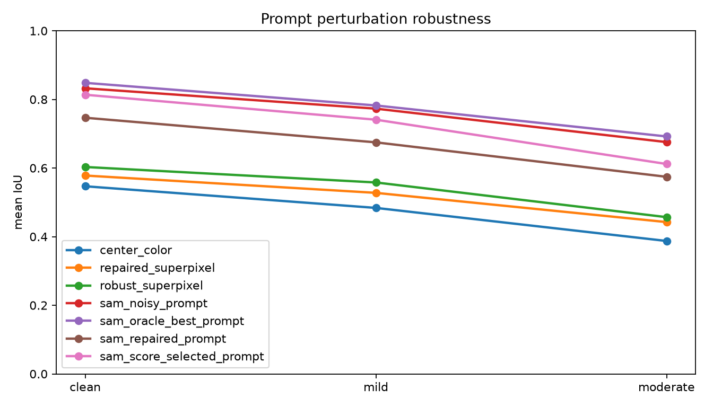
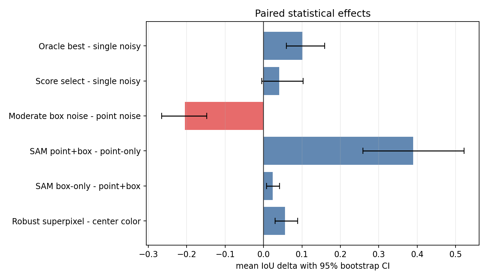
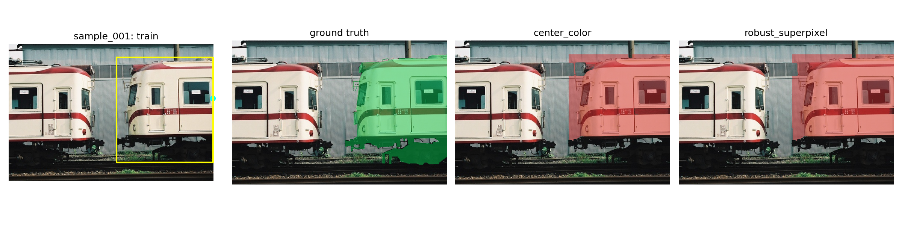
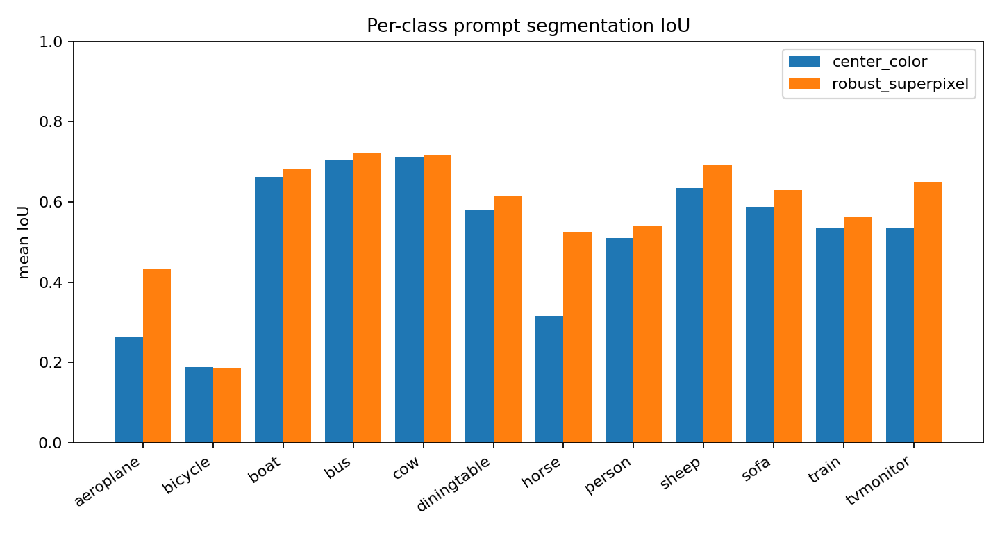
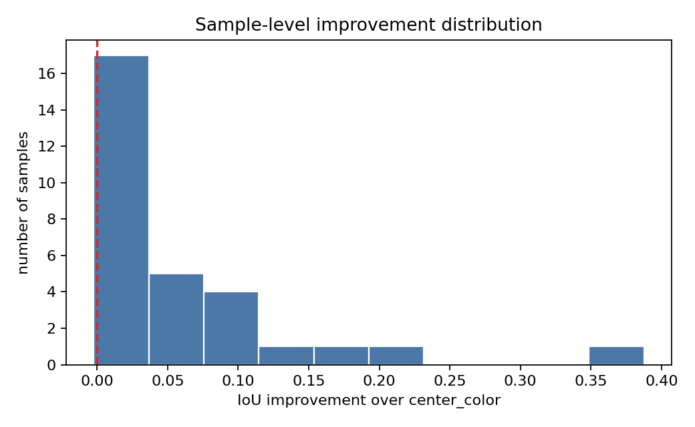
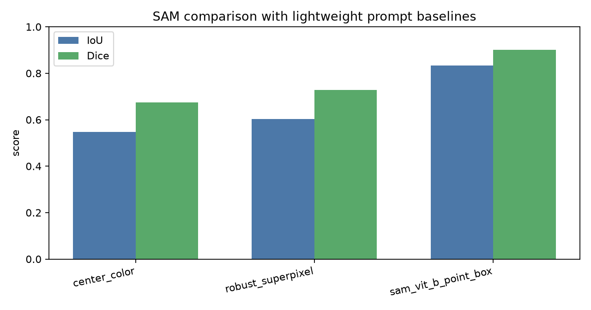

# PromptLite-Seg: Lightweight Zero-Shot Prompted Segmentation on PASCAL VOC 2012

Repository: https://github.com/ZhouYinLong-lab/PromptLite-Seg

## Abstract

PromptLite-Seg studies zero-shot prompted segmentation on PASCAL VOC 2012. Given a weak prompt, consisting of a center point and a bounding box, the goal is to segment the target object without training on the benchmark. I implement a simple color-threshold baseline, a stronger training-free robust superpixel method, and an optional GPU SAM ViT-B comparison. The robust method uses foreground/background prototypes induced by the prompt, a box constraint, and perturbation consensus. The project produces quantitative IoU/Dice results and qualitative visualizations on a reproducible VOC 2012 validation subset.

The final version adds prompt-robustness, prompt-uncertainty, and paired statistical reliability benchmarks. Instead of evaluating only perfect center-point and bounding-box prompts, it perturbs prompts, decomposes point noise versus box noise, compares point-only/box-only/point+box SAM prompting, and tests multi-prompt selection. This turns the project from a single-score comparison into an analysis of prompt sensitivity with confidence intervals.

## 1. Introduction

Prompted segmentation has become a practical interface for general-purpose vision systems. Classic interactive systems such as GrabCut showed that a loose user box can provide enough foreground and background evidence for object extraction [2]. Later deep interactive methods studied stronger point-based guidance, including extreme-point prompts in DEXTR [3], iterative click correction with mask guidance [4], and click encoding with vision transformers in SimpleClick [5]. More recently, the Segment Anything Model (SAM) demonstrated a general promptable segmentation interface that accepts points and boxes and transfers zero-shot to new tasks [6]. This project therefore asks a complementary question: how far can a transparent, training-free prompted segmentation algorithm go on real benchmark images, and how sensitive is SAM to the structure of its prompts?

The task follows the course-design direction of zero-shot prompt segmentation. The benchmark is PASCAL VOC 2012, a standard object recognition and segmentation benchmark with semantic labels and evaluation protocols [1]. For each sample, I select the largest semantic object component, convert it into a binary target mask, and derive a tight bounding box and an interior center point.

## 2. Method

### 2.1 Prompt Generation

For each VOC validation image, the semantic mask provides class labels from 1 to 20 and background label 0. I select the largest connected foreground component as the target object. The bounding-box prompt is the tight box around this component. The point prompt is chosen as the pixel with maximum distance-transform value inside the component, which approximates a stable central click.

### 2.2 Center-Color Baseline

The baseline uses only the prompt point and bounding box. It estimates the target color by taking the median RGB value in a small disk around the point. Pixels inside the bounding box are segmented if their color distance to this prototype is below an adaptive Otsu threshold. Finally, small components are removed and the component nearest to the point is kept.

### 2.3 Robust Superpixel Prompt Segmentation

The proposed method first runs the center-color baseline to obtain a conservative foreground seed. It then oversegments the image into SLIC superpixels, which were designed to provide efficient boundary-aware image primitives [7]. Each superpixel is represented by mean Lab color and normalized spatial coordinates. Foreground prototypes are estimated from superpixels intersecting the center-point disk, while background prototypes are estimated from superpixels outside the prompt box and along the box border. Each superpixel receives a foreground score based on relative distance to these prototypes, combined with a weak spatial prior centered at the prompt point. The final mask is the union of the conservative color seed and the superpixel consensus across slightly perturbed boxes, followed by morphology and point-connected component selection.

This method is zero-shot because it uses no training examples, no VOC labels except for prompt construction during evaluation, and no learned parameters.

## 3. Experimental Setup

The experiment uses PASCAL VOC 2012 validation samples [1] from the Hugging Face mirror `nateraw/pascal-voc-2012`. A compact subset is produced by `scripts/download_voc_subset.py`, which stores the RGB image, semantic mask, target binary mask, bounding box, and center point for each sample.

Metrics:

- Intersection over Union (IoU)
- Dice score

Commands:

```bash
python scripts/download_voc_subset.py --count 30
python scripts/run_experiment.py --data-dir data/voc_subset --output-dir outputs --max-samples 30
.\.venv-sam\Scripts\python.exe scripts/run_robustness_experiment.py --max-samples 30 --trials 2 --include-sam --device cuda
.\.venv-sam\Scripts\python.exe scripts/run_prompt_uncertainty_experiment.py --max-samples 30 --trials 2 --ensemble-size 5 --device cuda
python scripts/analyze_statistics.py
```

## 4. Results

The experiment was run on 30 VOC 2012 validation samples. Aggregate results are stored in `outputs/summary.json`, and per-sample results are stored in `outputs/metrics.csv`.

| Method | Mean IoU | Std IoU | Mean Dice | Std Dice |
| --- | ---: | ---: | ---: | ---: |
| Center-color baseline | 0.5468 | 0.2323 | 0.6754 | 0.2122 |
| Robust superpixel | 0.6031 | 0.2111 | 0.7277 | 0.1895 |
| SAM ViT-B point+box | 0.8325 | 0.1484 | 0.9002 | 0.1044 |

The robust superpixel method improves mean IoU by 0.0562 absolute points over the center-color baseline and improves mean Dice by 0.0523. The lower standard deviation also suggests that the method is less sensitive to difficult images where the center color is not representative of the whole object.

The optional GPU SAM ViT-B point+box comparison reaches 0.8325 mean IoU and 0.9002 mean Dice, confirming that the same prompts are strong enough for a modern foundation segmentation model. The lightweight method remains useful as a transparent SAM-free baseline and as a low-cost diagnostic method.

## 4.1 Prompt Robustness

To evaluate prompt sensitivity, `scripts/run_robustness_experiment.py` perturbs both the center point and the bounding box. Mild perturbations shift the point and box by roughly 5-6% of object size; moderate perturbations use roughly 10-12%. Each non-clean severity is evaluated with two deterministic trials per sample.

| Severity | Method | Mean IoU | Mean Dice |
| --- | --- | ---: | ---: |
| clean | robust_superpixel | 0.6031 | 0.7277 |
| mild | robust_superpixel | 0.5579 | 0.6927 |
| moderate | robust_superpixel | 0.4568 | 0.5967 |
| clean | SAM ViT-B noisy prompt | 0.8325 | 0.9002 |
| mild | SAM ViT-B noisy prompt | 0.7731 | 0.8537 |
| moderate | SAM ViT-B noisy prompt | 0.6756 | 0.7795 |

The robustness benchmark reveals the main limitation of prompt segmentation: SAM has much higher absolute accuracy, but it still loses about 0.157 IoU under moderate prompt noise. A naive lightweight prompt repair strategy does not improve SAM; it reduces moderate-noise SAM IoU from 0.6756 to 0.5745. SAM's own score-based selection also underperforms the original noisy prompt at 0.6118. This is a useful negative result: transparent repair masks are helpful for analysis, but SAM's native point+box interface already preserves more information than the repaired prompt.



## 4.2 Prompt Uncertainty

The deeper experiment asks three research questions and connects them to the distinction between box-driven interactive segmentation [2] and click-driven correction methods [4, 5]:

- Which clean prompt modality is most informative?
- Is SAM more sensitive to point noise or box noise?
- Can multiple plausible prompts recover performance under noisy annotation?

| Setting | Condition | Mean IoU | Mean Dice |
| --- | --- | ---: | ---: |
| clean modality | point-only | 0.4430 | 0.5303 |
| clean modality | box-only | 0.8565 | 0.9150 |
| clean modality | point+box | 0.8325 | 0.9002 |
| moderate noise | point noise | 0.8507 | 0.9116 |
| moderate noise | box noise | 0.6462 | 0.7520 |
| moderate noise | point+box noise | 0.6385 | 0.7416 |
| moderate ensemble | single noisy prompt | 0.6385 | 0.7416 |
| moderate ensemble | score selection | 0.6796 | 0.7801 |
| moderate ensemble | consistency medoid | 0.6581 | 0.7595 |
| moderate ensemble | oracle best-of-six | 0.7401 | 0.8284 |

The main finding is that SAM ViT-B is box-dominated on this subset. Box-only prompting outperforms point+box prompting, while point-only prompting is unstable. Point perturbation barely hurts performance, but box perturbation causes the major collapse. Multi-prompt score selection partially recovers the moderate point+box noise drop, improving mean IoU from 0.6385 to 0.6796, while the oracle best-of-six reaches 0.7401. This creates a concrete future direction: calibrated prompt-quality estimation.

## 4.3 Statistical Reliability

To avoid relying only on point estimates, `scripts/analyze_statistics.py` computes paired bootstrap 95% confidence intervals and paired sign-flip permutation tests over sample-level deltas. For prompt-noise and ensemble experiments with two trials per sample, trials are averaged inside each sample before testing.

| Comparison | Delta IoU | 95% CI | p-value |
| --- | ---: | ---: | ---: |
| Robust superpixel vs center-color | 0.0562 | [0.0301, 0.0891] | 0.00002 |
| SAM box-only vs point+box | 0.0240 | [0.0080, 0.0421] | 0.00922 |
| Moderate box noise vs point noise | -0.2044 | [-0.2655, -0.1474] | 0.00002 |
| Score selection vs single noisy prompt | 0.0411 | [-0.0044, 0.1029] | 0.15418 |
| Oracle best-of-six vs single noisy prompt | 0.1017 | [0.0593, 0.1589] | 0.00002 |

The statistical layer strengthens three conclusions: the robust superpixel improvement is stable, box-only SAM really outperforms point+box on this subset, and box noise is much worse than point noise. It also weakens one claim: score-based prompt selection has a positive mean effect, but the confidence interval crosses zero, so it should be treated as promising rather than statistically confirmed. The oracle result remains significant, proving recoverable headroom exists.




The qualitative figures in `outputs/figures/` compare the original prompt, the ground-truth target, and the predictions of both methods. The summary bar chart is saved as `outputs/figures/metric_summary.png`.




Additional analysis is generated by `scripts/analyze_results.py`. On the 30-sample subset, the robust method wins on 23 samples, ties on 5 samples, and loses on only 2 samples relative to the center-color baseline. The largest gains appear on horse, tvmonitor, and aeroplane examples, where pure center-color thresholding tends to under-cover the object.







## 5. Analysis

The center-color baseline works when the object has a compact appearance and contrasts clearly with the local background. It fails when the object has multiple colors, when the center click lands on a non-representative part, or when the surrounding background has similar color.

The robust superpixel method improves the prompt interface in three ways. First, superpixels respect local image boundaries better than raw pixel color thresholding. Second, the method uses background evidence from the box boundary and outside-box region, which helps suppress leakage to nearby clutter. Third, perturbing the box and taking consensus reduces sensitivity to one exact prompt box.

The method still struggles with thin structures, complex object interiors, and cases where the bounding box contains multiple visually similar objects. It can also over-segment when the target object and background share large superpixels or similar Lab color statistics.

The hardest cases in the current subset include train, bicycle, diningtable, and boat examples. These cases expose different failure modes: train and diningtable instances often contain repetitive interior structures, bicycle masks contain thin parts that are easy to miss, and boat images may have strong background colors inside the prompt box.

Compared with SAM-style models, this method is much weaker in semantic understanding, but it is transparent, CPU-friendly, and easy to analyze. The implemented SAM ViT-B comparison shows the performance ceiling available from a foundation segmentation model, while the proposed method provides a reproducible low-resource baseline.

The robustness experiment adds a stronger research conclusion. The project does not merely show that SAM is better; it quantifies how much prompt noise hurts different methods and shows that naive prompt repair is not automatically beneficial for foundation models. This gives a clearer direction for future work: repair should preserve prompt uncertainty rather than collapse it to a single mask-derived point and box.

The prompt uncertainty experiment further shows that prompt quality is structured rather than scalar. The bounding box is the dominant prompt channel in this benchmark, and the confidence intervals show that this is not merely a visual impression. Future robustness methods should focus on box uncertainty, multi-box sampling, or reliability estimation rather than treating point and box errors as equivalent.

## 6. Conclusion

This project implements and evaluates a zero-shot prompted segmentation pipeline on PASCAL VOC 2012. The main contribution is a reproducible CPU-friendly baseline, an enhanced robust superpixel method, and a GPU-backed analysis of prompt uncertainty with paired statistical evidence. The project satisfies the course requirement of running an algorithm on a benchmark and adds a clear research conclusion: SAM is strong, but its robustness depends primarily on the bounding-box channel, and multi-prompt selection has recoverable headroom that still needs better calibration.

## References

1. Mark Everingham, Luc Van Gool, Christopher K. I. Williams, John Winn, and Andrew Zisserman. The PASCAL Visual Object Classes Challenge. IJCV 2010; VOC 2012 challenge data. https://www.robots.ox.ac.uk/~vgg/projects/pascal/VOC/voc2012/
2. Carsten Rother, Vladimir Kolmogorov, and Andrew Blake. GrabCut: Interactive Foreground Extraction using Iterated Graph Cuts. ACM TOG/SIGGRAPH 2004. https://dl.acm.org/doi/10.1145/1015706.1015720
3. Kevis-Kokitsi Maninis, Sergi Caelles, Jordi Pont-Tuset, and Luc Van Gool. Deep Extreme Cut: From Extreme Points to Object Segmentation. CVPR 2018. https://arxiv.org/abs/1711.09081
4. Konstantin Sofiiuk, Ilia A. Petrov, and Anton Konushin. Reviving Iterative Training with Mask Guidance for Interactive Segmentation. arXiv:2102.06583, 2021. https://arxiv.org/abs/2102.06583
5. Qin Liu, Zhenlin Xu, Gedas Bertasius, and Marc Niethammer. SimpleClick: Interactive Image Segmentation with Simple Vision Transformers. ICCV 2023. https://arxiv.org/abs/2210.11006
6. Alexander Kirillov et al. Segment Anything. ICCV 2023. https://arxiv.org/abs/2304.02643
7. Radhakrishna Achanta et al. SLIC Superpixels Compared to State-of-the-Art Superpixel Methods. IEEE TPAMI 2012. https://doi.org/10.1109/TPAMI.2012.120
